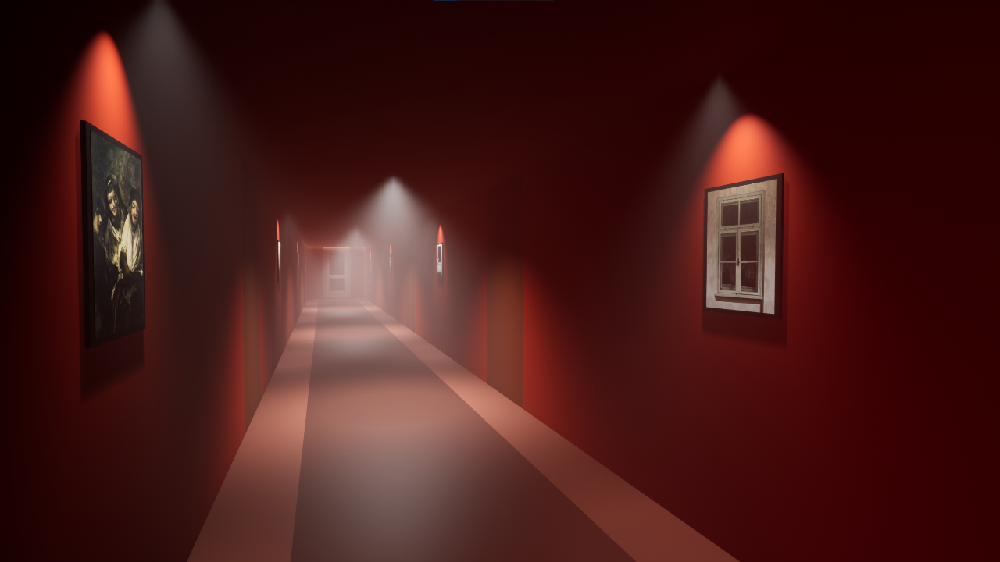
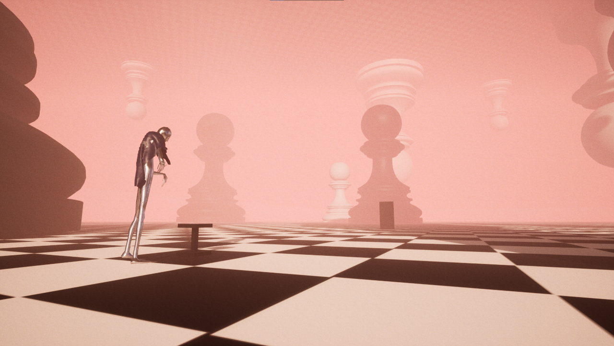

# Project Dream
A narrative horror dreamcore stylised Unreal Engine 5 game, created by me & [sawolej](https://github.com/sawolej).

## Description
Set in unreal, dreamy world, you wake up as a 40 year old man, having a thirst for a glass of water. It is not until you've left the hotel room have you realised something was off. The irrational presence of chess figures, misty silhouettes creeping around and the shivers all over your spine are only the beginning of a story you have yet to unfold. Brace yourself, for there is little as ominous as discovering the truth about oneself.

## Walkthrough
The gameplay is hosted on YouTube and can be found [here](https://www.youtube.com/watch?v=mUvXX5w2i7o).

## Screenshots

